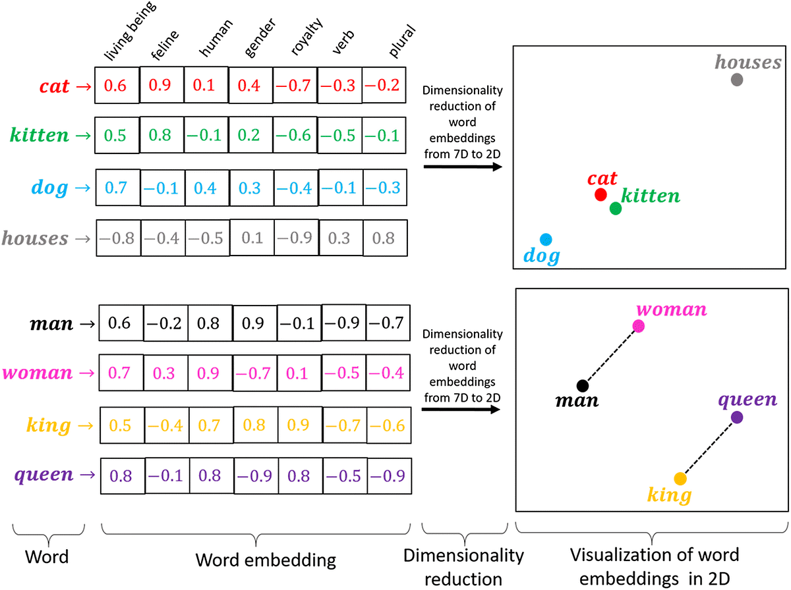

# 1.0 Chat Completion
1.1 Simple Prompt

1.2 Message Types, AI Calling Process

1.3 Prompt Template

1.4 Output Parser

## 1.1 Simple Prompt
## 1.2 Message Types
A few types of messages available to help with prompt engineering:

| Message Type      | Description                                                                                                 |
|-------------------|-------------------------------------------------------------------------------------------------------------|
| System Message    | Comes from the application, AI will try their best to fulfill (provided doesn't violate Open AI policies).  |
| User Message      | User queries.                                                                                               |
| Assistant Message | Comes from the AI. Useful to store chat history and provide important context.                              |
| Function Message  | Used for calling system functions follow AI's function protocol. Will dive deeper in Function Calling demo. |

### 1.2.1 AI Calling Process

## 1.3 Prompt Template
## 1.4 Structured Output Converters
- MapOutputConverter
- BeanOutputConverter
- ListOutputConverter

## 1.5 Advisor

## 1.6 Function Calling

# 2.0 RAG (Retrieval Augmented Generation)

## 2.1 Embedding

## 2.2 Prompt Stuffing

# 3.0 Additional Tools
- 3.1 Image Generation
- 3.3 Speech-to-Text
- 3.4 Text-to-Speech